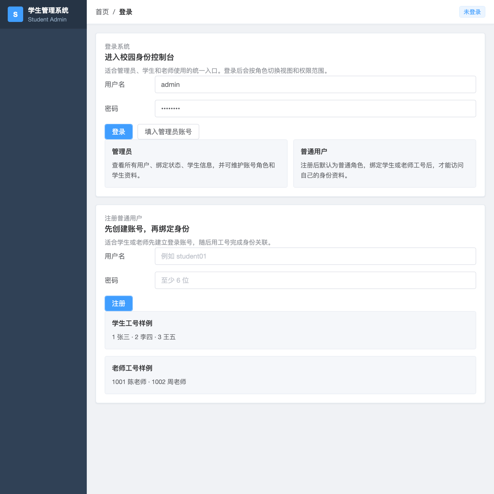
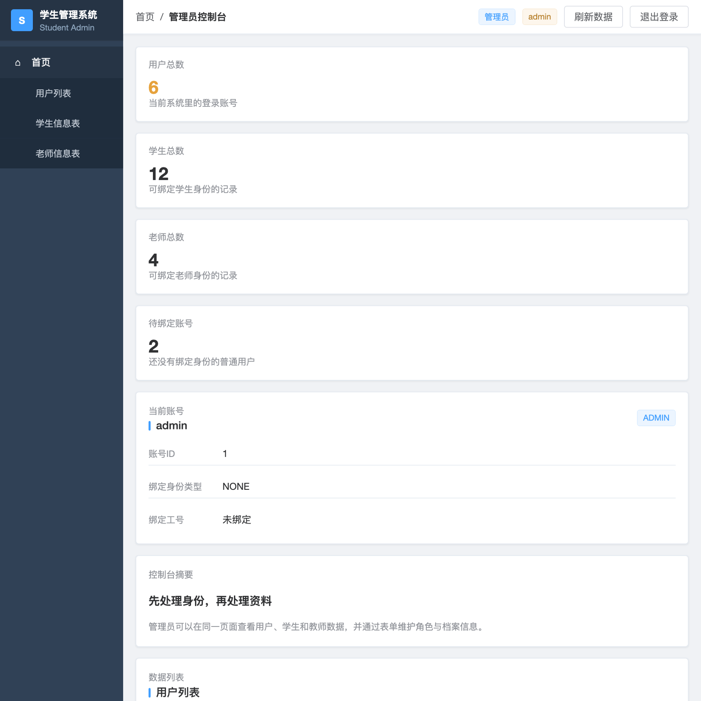
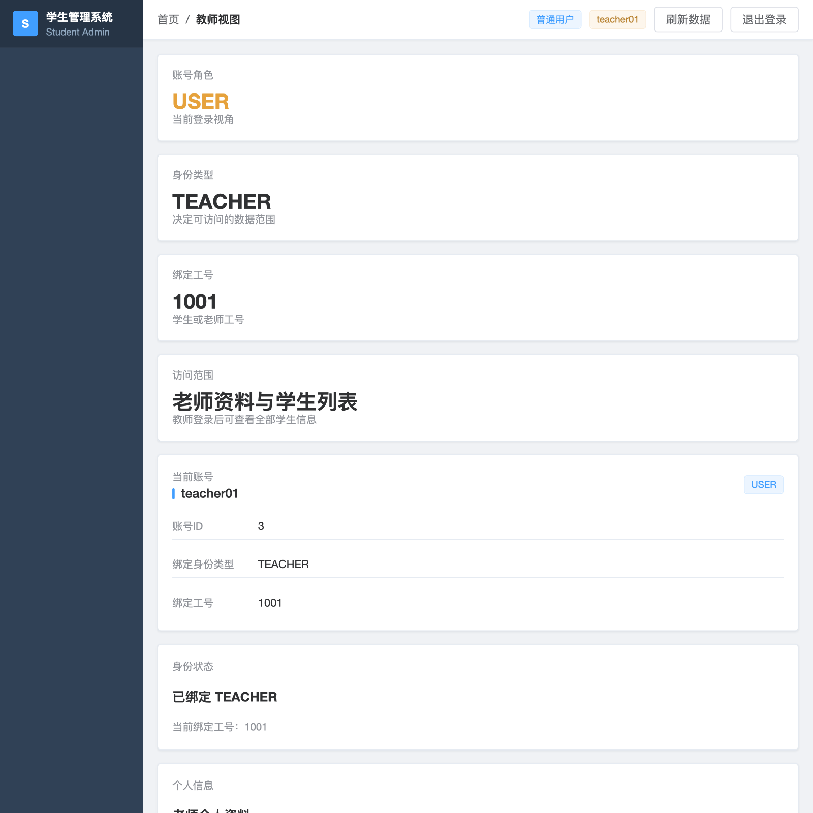

# 学生管理系统

一个基于 Spring Boot + MyBatis + MySQL + 原生前端页面 的教学型学生管理系统，支持账号注册登录、身份绑定、学生/教师资料查询与维护，以及基于角色的权限控制。

## 项目亮点

- `HttpSession` 维护登录态
- `ADMIN / USER` 双角色权限控制
- 普通用户支持绑定 `STUDENT / TEACHER` 身份
- 管理员可维护用户、学生、教师信息
- 教师可查看学生信息
- 支持学生成绩查询与成绩维护
- 支持成绩请求提交与管理员铃铛审批
- 提供前端控制台页面，适合演示完整业务流
- 附带请求通知系统设计文档，便于继续扩展铃铛消息中心

## 技术栈

- 后端：Spring Boot 3.x
- 持久层：MyBatis
- 数据库：MySQL
- 前端：HTML + CSS + JavaScript
- 构建工具：Maven

## 功能概览

### 1. 账号与登录

- 普通用户注册
- 用户登录 / 退出登录
- 基于 Session 的登录态恢复

### 2. 身份绑定

- 普通用户可绑定学生工号
- 普通用户可绑定教师工号
- 一个工号只能绑定一个账号

### 3. 角色权限

- `ADMIN`
  - 查看全部用户
  - 查看全部学生
  - 查看全部教师
  - 查看全部成绩
  - 修改用户角色与绑定
  - 新增 / 修改 / 删除学生
  - 新增 / 修改教师
  - 新增 / 修改成绩
  - 查看铃铛消息并处理请求
- `USER + STUDENT`
  - 查看自己的学生资料
  - 查看自己的成绩
  - 提交成绩复核请求
- `USER + TEACHER`
  - 查看自己的教师资料
  - 查看学生列表
  - 查看学生成绩
  - 新增 / 修改成绩
  - 提交成绩更正请求

## 前端页面

### 登录 / 注册页

用于统一进入系统，支持普通用户注册和管理员快捷登录。



### 管理员控制台

管理员可查看账号统计、用户列表、学生信息表、教师信息表，并通过右侧表单维护资料。



### 教师视图

教师登录后可查看自己的教师资料，同时查看学生列表。



## 当前功能清单

- 认证与登录
  - 注册、登录、退出、Session 恢复
- 身份绑定
  - 绑定学生 / 教师工号
- 学生管理
  - 管理员增删改查
  - 教师查看学生信息
  - 学生查看自己的资料
- 教师管理
  - 管理员增改查
  - 教师查看自己的资料
- 成绩管理
  - 管理员查看 / 新增 / 修改成绩
  - 教师查看 / 新增 / 修改成绩
  - 学生查看自己的成绩
- 请求与通知
  - 学生提交成绩复核请求
  - 教师提交成绩更正请求
  - 管理员铃铛查看未读数
  - 管理员查看请求详情并审批

## 目录结构

```text
src/main/java/com/example/demo
├── common        # 通用返回体、工具类
├── controller    # 控制器
├── dto           # 请求 DTO
├── entity        # 实体类
├── exception     # 业务异常与全局异常处理
├── mapper        # MyBatis Mapper 接口
└── service       # 业务逻辑

src/main/resources
├── mapper        # MyBatis XML
├── static        # 前端页面资源
├── application.properties
├── schema.sql
└── data.sql
```

## 数据库配置

项目默认连接本地 MySQL：

```properties
spring.datasource.url=jdbc:mysql://localhost:3306/test?useUnicode=true&characterEncoding=utf8&serverTimezone=Asia/Shanghai&useSSL=false
spring.datasource.username=root
spring.datasource.password=123456
```

请确保：

1. 本地已启动 MySQL
2. 存在 `test` 数据库
3. 用户名密码与配置一致

## 启动方式

### 1. 初始化数据库

项目启动时会自动执行：

- `schema.sql`
- `data.sql`

默认会生成：

- 学生测试数据
- 教师测试数据
- 管理员账号：`admin / admin123`

### 2. 启动项目

```bash
mvn spring-boot:run
```

### 3. 访问页面

启动成功后访问：

```text
http://localhost:8080
```

## 常用接口

### 认证

- `POST /auth/register`
- `POST /auth/login`
- `GET /auth/me`
- `POST /auth/bind`
- `POST /auth/logout`

### 学生

- `GET /students`
- `GET /students/{id}`
- `GET /students/me`
- `POST /students`
- `PUT /students/{id}`
- `DELETE /students/{id}`

### 教师

- `GET /teachers`
- `GET /teachers/{id}`
- `GET /teachers/me`
- `POST /teachers`
- `PUT /teachers/{id}`

### 成绩

- `GET /scores`
- `GET /scores/{id}`
- `GET /scores/me`
- `POST /scores`
- `PUT /scores/{id}`

### 请求与通知

- `POST /requests`
- `GET /requests/my`
- `GET /requests/my/{id}`
- `GET /admin/notifications/unread-count`
- `GET /admin/requests`
- `GET /admin/requests/{id}`
- `PUT /admin/requests/{id}/read`
- `PUT /admin/requests/{id}/handle`

### 用户

- `GET /users`
- `PUT /users/{id}`

## 最近这次改动

- 增加学生成绩模块，包括成绩表、查询接口和维护接口
- 补充教师 / 学生 / 管理员三种视角下的成绩展示
- 实现成绩请求提交与“我的请求”列表
- 实现管理员顶部铃铛未读数、请求列表、详情和审批处理
- 补充项目结构与功能文档

## 扩展设计

项目已补充“请求提交 + 管理员铃铛通知 + 详情页处理”的设计文档：

- [请求通知系统设计](docs/request-notification-system.md)
- [项目结构与功能说明](docs/project-structure-and-features.md)

适合继续扩展：

- 请求审批流
- 管理员消息中心
- 顶部铃铛未读数
- 我的请求记录

## 测试账号

```text
管理员：admin / admin123
```

## 说明

这是一个非常适合课程实验、权限系统练习、Spring Boot + MyBatis 入门演示的项目。当前版本已经具备清晰的角色划分、基础数据维护能力和可直接展示的前端管理台。
